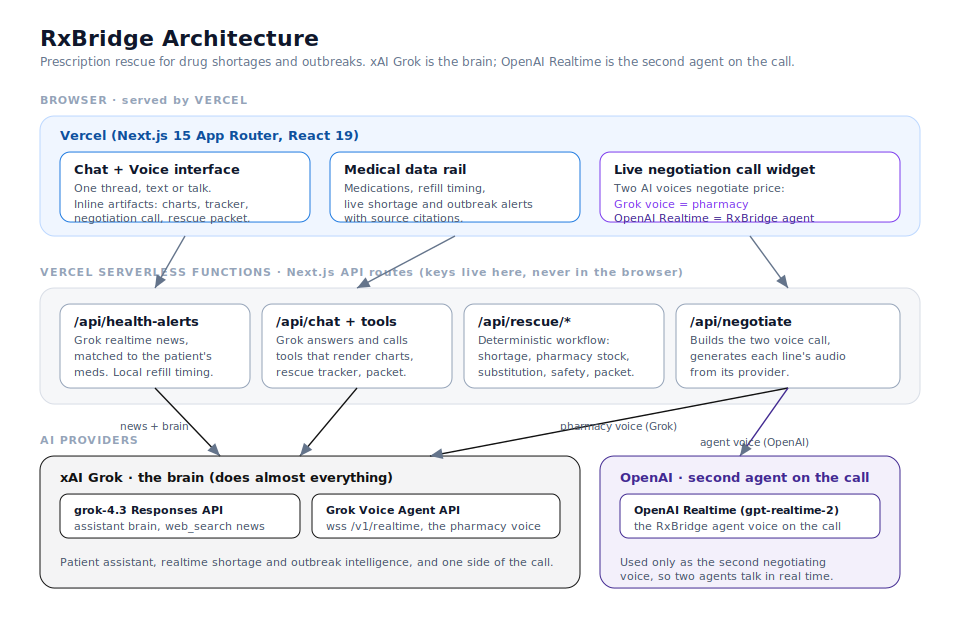

<div align="center">

# 💊 RxBridge

### When a drug shortage or outbreak means a patient can't get their medicine, RxBridge finds an in-stock alternative and calls the doctor and pharmacy to arrange it.

Built for the **xAI hackathon**. Grok is the brain: it runs the patient
assistant, the realtime shortage and outbreak intelligence, and one of the two
voices on the negotiation call. OpenAI Realtime is brought in only as the
**second agent on that call**, so two AI voices can negotiate live.


**Drug shortage rescue · realtime Grok intelligence · two AI voices negotiating · inline charts and widgets**

</div>

---

## Table of Contents

- [Overview](#overview)
- [Why xAI](#why-xai)
- [Architecture](#architecture)
- [Status at a Glance](#status-at-a-glance)
- [Screens](#screens)
- [Quick Start](#quick-start)
- [Deploying to Vercel](#deploying-to-vercel)
- [Configuration](#configuration)
- [Repository Map](#repository-map)
- [How It Works](#how-it-works)
- [Safety and Privacy](#safety-and-privacy)
- [Verification](#verification)
- [Contributing](#contributing)
- [License](#license)

---

## Overview

Drug shortages and global outbreaks leave real patients unable to get the
medicine they depend on. Most tools stop at "we could not find your
medication." RxBridge starts there. It detects that a medication is
unavailable, finds an in-stock alternative, and then **places a real two voice
call** to negotiate a price and reserve it, so the patient does not go without.

The product is one conversational interface, text and voice, with a three pane
workspace:

- **Left**: the conversation history, every question the patient has asked.
- **Center**: the chat, with a Text and Voice switch. The patient types or
  talks, and the assistant renders interactive widgets inline, charts, a live
  rescue tracker, a substitution comparison, the negotiation call, and the
  final rescue packet, the way Claude and ChatGPT render artifacts.
- **Right**: the patient's medical data, medications with refill timing, and
  realtime shortage and outbreak alerts matched to those medications.

## Why xAI

**Grok does almost everything in RxBridge.** It is strong at current events, so
it is the natural engine for a product about live drug shortages and outbreaks:

- **The patient assistant brain.** Grok (`grok-4.3`, Responses API) answers the
  patient, decides which tools to call, and explains the rescue in plain
  language.
- **Realtime shortage and outbreak intelligence.** Grok's `web_search` tool
  pulls live news and official sources (FDA and ASHP drug shortage lists, health
  agencies, pharmacy notices) and returns structured, cited alerts matched to
  the patient's medications.
- **The pharmacy voice on the call.** The Grok Voice Agent API
  (`wss://api.x.ai/v1/realtime`) speaks as the pharmacy during the negotiation.

**OpenAI is used in exactly one place: the second agent on the call.** A
negotiation needs two parties, so the **RxBridge agent voice** is driven by
OpenAI Realtime while the **pharmacy voice** is Grok. That is the whole reason
both providers are present, two agents, talking and negotiating in real time.

## Architecture



```
   Browser (served by Vercel)                Next.js App Router, React 19
      Chat + voice interface, medical rail, inline widgets
                 │
                 ▼
   Vercel serverless functions (Next.js API routes, all keys server side)
      /api/health-alerts   /api/chat   /api/rescue/*   /api/negotiate   ...
                 │
        ┌────────┴───────────────────────────────┐
        ▼                                          ▼
   xAI Grok  (the brain)                     OpenAI Realtime
     grok-4.3 assistant + web_search news      gpt-realtime-2, the RxBridge
     Grok Voice Agent = pharmacy voice         agent voice, second on the call
```

- **Frontend on Vercel**: Next.js 15 App Router and React 19. The chat and
  voice share one conversation; the assistant attaches typed artifacts to its
  turns and the interface renders them inline (charts via Recharts, the rescue
  tracker, the negotiation call widget, the rescue packet).
- **Vercel serverless functions**: every provider call happens in a Next.js API
  route, so the xAI and OpenAI keys live on the server and never reach the
  browser.
- **xAI Grok, the brain**: the assistant, the realtime news subagent, and the
  pharmacy voice.
- **OpenAI Realtime, the second voice**: only the RxBridge agent's side of the
  negotiation call, so two AI voices negotiate live.

## Status at a Glance

| Area | State |
|------|-------|
| Text chat and voice in one interface | ✅ Implemented |
| Grok assistant brain with tool calling | ✅ Implemented |
| Realtime shortage and outbreak alerts via Grok web search | ✅ Implemented |
| Inline interactive widgets (charts, tracker, packet) | ✅ Implemented |
| Deterministic rescue workflow (shortage, pharmacy, substitution, safety, packet) | ✅ Implemented |
| Two voice negotiation call (Grok pharmacy, OpenAI agent) | ✅ Implemented |
| Medication refill urgency computed locally from patient data | ✅ Implemented |
| Same origin check and rate limit on paid routes | ✅ Implemented |
| Patient safety guardrails (never prescribes, candidate alternatives only) | ✅ Implemented |
| Vercel deployment | ✅ Supported (see below) |
| Patient data source | 🧪 Sample data (swap for a real, authenticated EHR or pharmacy lookup) |
| Grok voice audio scope | 🔑 Plays real Grok audio when the xAI key is entitled, falls back to browser speech otherwise |
| Real outbound telephony | ⛔ Not in scope (the call is an in app two voice negotiation) |

## Screens

A three pane workspace: conversation history on the left, the chat with a Text
and Voice switch in the center, and the patient's medical data on the right.

```
┌──────────────┬───────────────────────────┬──────────────────┐
│ RxBridge                                                      │
├──────────────┼───────────────────────────┼──────────────────┤
│ History      │        [ Text | Voice ]   │ Your medical data│
│              │                           │                  │
│ ozempic?     │  I found an in stock      │ Semaglutide  now │
│ refill meds  │  alternative and called   │ Levothyroxine ok │
│ shortage     │  the pharmacy for you.    │ Alerts + sources │
│              │                           │                  │
│              │  [ Live call: Grok vs     │                  │
│              │    OpenAI, agreed $42 ]   │                  │
│              │  [ Type a message…  Send ]│                  │
└──────────────┴───────────────────────────┴──────────────────┘
```

## Quick Start

> Prerequisites: **Node.js 18.18+** (Node 20+ recommended). An **xAI key** powers
> the assistant, the alerts, and the pharmacy voice. An **OpenAI key** powers the
> RxBridge agent voice on the call. Voice mode needs a browser with microphone
> permission on `http://localhost` or HTTPS, since mic capture requires a secure
> context.

```bash
# 1. Install dependencies
npm install

# 2. Add your keys
cp .env.example .env.local      # macOS / Linux
#   on Windows PowerShell:  Copy-Item .env.example .env.local
# then open .env.local and set XAI_API_KEY=xai-...  and  OPENAI_API_KEY=sk-...

# 3. Run the dev server
npm run dev
```

Open <http://localhost:3000>. Type a message to chat, or switch to Voice, tap
the mic, allow mic access, and start talking.

## Deploying to Vercel

RxBridge is a standard Next.js 15 App Router app, so it deploys to **Vercel**
with zero configuration. The API routes become Vercel serverless functions, and
the chat and voice interface is served from Vercel's edge.

```bash
# Option A: the Vercel CLI
npm i -g vercel
vercel            # first run links the project
vercel --prod     # production deploy
```

Or connect the GitHub repo at <https://vercel.com/new> and Vercel builds on
every push to `main`.

**Set the environment variables in the Vercel project** (Project Settings,
Environment Variables), the same keys as `.env.local`:

| Variable | Notes |
|----------|-------|
| `XAI_API_KEY` | Required. Powers the Grok assistant, news, and pharmacy voice. |
| `OPENAI_API_KEY` | Required for the RxBridge agent voice on the call. |
| `XAI_MODEL`, `OPENAI_CHAT_MODEL`, `OPENAI_REALTIME_MODEL`, `OPENAI_REALTIME_VOICE` | Optional model overrides. |

Keys are only read server side inside the API routes, so they stay out of the
client bundle. Never prefix a key with `NEXT_PUBLIC_`.

## Configuration

All configuration is via environment variables in `.env.local` (git ignored),
or the Vercel project settings in production.

| Variable | Required | Default | Effect |
|----------|----------|---------|--------|
| `XAI_API_KEY` | **Yes** | none | xAI / Grok key. Powers the assistant brain, the realtime news alerts, and the pharmacy voice. The primary key for this app. |
| `XAI_MODEL` | No | `grok-4.3` | Grok model for the assistant and news subagent. |
| `OPENAI_API_KEY` | For the call | none | Used server side for the RxBridge agent voice during the negotiation call (the second agent). |
| `OPENAI_CHAT_MODEL` | No | `gpt-5.5` | Fallback text chat model. |
| `OPENAI_REALTIME_MODEL` | No | `gpt-realtime-2` | Realtime model for the agent voice. |
| `OPENAI_REALTIME_VOICE` | No | `marin` | The agent voice. |

> Never prefix a key with `NEXT_PUBLIC_`. That would ship it to the browser.

## Repository Map

| Path | Role |
|------|------|
| `app/page.tsx` | The three pane UI: history, chat with Text and Voice switch, medical data rail. |
| `app/api/chat/route.ts` | Grok assistant with tool calling, streams the reply and attaches artifacts. |
| `app/api/health-alerts/route.ts` | The Grok news subagent: live search, merged with local refill timing. |
| `app/api/negotiate/route.ts` | Builds the two voice negotiation call (Grok pharmacy, OpenAI agent). |
| `app/api/rescue/*` | Deterministic rescue workflow: start, authorize, confirm fill. |
| `app/api/realtime-session/route.ts` | Mints the OpenAI Realtime ephemeral token for the agent voice. |
| `lib/xai.ts` | Grok client. Responses API with `web_search` and structured output. |
| `lib/services/voice-tts.ts` | Generates each call line's audio: OpenAI for the agent, Grok Voice Agent for the pharmacy. |
| `lib/services/*` | shortage, pharmacy, substitution, safety, packet, rescue workflow. |
| `lib/patient-data.ts` | Sample patient records, medications, history, and refill urgency logic. |
| `components/artifacts/*` | The inline widgets: chart, medication list, rescue tracker, substitution compare, rescue packet, negotiation call. |
| `docs/assets/architecture.svg` | The architecture diagram shown above. |
| `.env.example` | Template for the env file. |

## How It Works

1. The patient says a medication is unavailable, or asks to see their health
   data. The Grok assistant calls a tool.
2. Tools run deterministic services on the server (shortage, pharmacy stock,
   substitution, safety) and return structured data.
3. The interface renders that data inline as widgets: a days of supply chart,
   the rescue tracker, the candidate comparison.
4. The patient asks to arrange the fill. `/api/negotiate` runs a two voice call,
   the OpenAI agent and the Grok pharmacy trade prices and reserve the
   alternative, rendered as a live call widget with a price ledger.
5. The patient gets a rescue packet: the approved alternative, the pharmacy, the
   agreed price, and what to do next.

## Safety and Privacy

- **Coordination, not clinical authority.** The assistant never prescribes.
  Until a prescriber authorizes, every option is a candidate alternative. It
  never invents alternatives, doses, chart values, or news.
- **Keys server side.** Both the xAI and OpenAI keys are read only inside the
  API routes and are never sent to the browser or prefixed with `NEXT_PUBLIC_`.
- **Synthetic data only.** Patient records are sample fixtures. No real
  protected health information is stored. Replace the data layer with an
  authenticated EHR or pharmacy lookup before any real use.
- **Emergencies.** The assistant escalates red flag symptoms to local emergency
  services first.

## Verification

```bash
npm run typecheck   # TypeScript: no type errors
npm run build       # Next.js production build compiles
npm run dev         # Manual: ask about a shortage, run the rescue and the call
```

## Contributing

Invariants to preserve when extending this project:

- Grok is the brain. Keep the assistant, news, and pharmacy voice on xAI.
- OpenAI Realtime is only the second agent on the negotiation call.
- Both keys stay server side. Never reference them from a client component or
  prefix with `NEXT_PUBLIC_`.
- The assistant never prescribes and only discusses candidates the tools return.
- Do not use em dash or en dash characters anywhere in source or output.

## License

No license file is currently checked in. Add one (for example a `LICENSE` with
MIT) before distributing.
